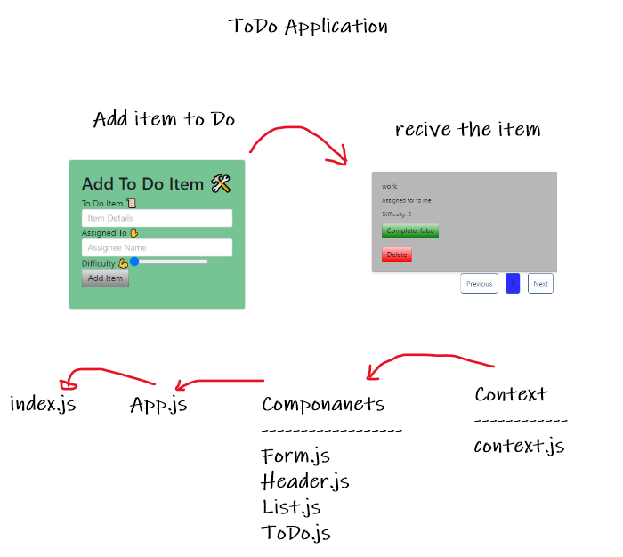

# todo-app

## Project Lab 34 Team Members :

- ***Mahmoud Khader***
- ***Maram AbuMurad***

## Description :

* *one way of using global states in React by using context API. that done by creating, providing, wrapping, and consumming the context.*
* *useForm is a custom hook that contains a function that will be called when you click on the submit button, and will handle onSumbit and onchange functions.*

## Deployment on SandBox 

* [SandBoxLab31](https://22yd7.csb.app/)
* [SandBoxLab32](https://7n5z8.csb.app/)
* [SandBoxLab33](https://3hmfp.csb.app/)
* [SandBoxLab34](https://bdndg.csb.app/)

## UML :

